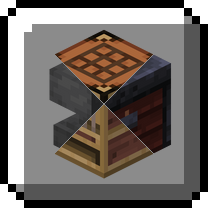

<h1 align="center">Extended Creative Menus</h1>

Adds 6 new menus to the creative inventory:
* **Rename** - rename items and add colors and formatting to item names.
* **Enchanting** - add enchantments to your tools, weapons, and armor.
* **Smithing** - customize armor trims.
* **Banners** - create and edit banners, and find presets for letters, numbers, and more.
* **Decorated Pots** - customize decorated pots with patterns on each side.
* **Fireworks** - create fireworks with customizable shapes, effects, and colors.

Adds more items to the creative inventory to make building easier:
- **Lit Copper Lamps** - pre-lit versions of all copper lamps.
- **Unlit Campfire & Soul Campfire** - place unlit campfires without having to manually put the fire out.
- **Ominous Vault & Trial Spanwer** - the ominous variants of the Vault and Trial Spawner which are only accessible with commands.s
- **Filled Chiseled Bookshelf** - a chiseled bookshelf with all 6 books.
- **Filled Composter** - a composter filled to the max level.

## Vanilla Minecraft compatible
This mod is client-side only. It's fully compatible with vanilla Minecraft servers, and you can join other people's worlds who don't have this mod installed.
